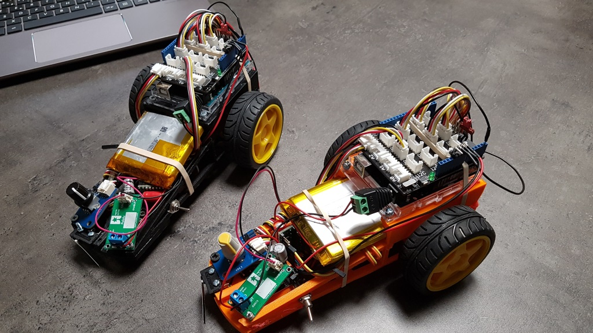

# Technologielike-RobotSuiveurDeLigne

Projet de robots suiveur de ligne

## Matériels nécessaire pour la construction du robot

Désignation                                                     | Fournisseur | Code commande | Quantité
----------------------------------------------------------------|:-----------:|:-------------:|:--------:
Starter kit Grove Plus V3 110060024                             | GoTronic    | [32908](https://www.gotronic.fr/art-starter-kit-grove-plus-v3-110060024-21825.htm)             | 1
Carte LiPo Rider Pro 106990008                                  | GoTronic    | [31355](https://www.gotronic.fr/art-carte-lipo-rider-pro-106990008-19050.htm)                  | 1
Accu Li-Ion 3,8 V 5100 mAh                                      | GoTronic    | [09744](https://www.gotronic.fr/art-accu-li-ion-3-8-v-5100-mah-5815.htm)                       | 1
Commande de 2 moteurs CC DRV8833 2x1,2A                         | GoTronic    | [32804](https://www.gotronic.fr/art-commande-de-2-moteurs-cc-drv8833-2x1-2a-21757.htm)         | 1
Régulateur 4 à 12 V S18V20ALV 2 A maxi                          | GoTronic    | [32774](https://www.gotronic.fr/art-regulateur-4-a-12-v-s18v20alv-21744.htm)                   | 1
Nappe de 40 câbles 20 cm de connexion M/F BBJ11                 | GoTronic    | [12321](https://www.gotronic.fr/art-nappe-de-40-cables-20-cm-de-connexion-m-f-bbj11-21991.htm) | 1
Paire de motoréducteurs DG02S 7,2 Vcc - 65 t/min - 0,8 kg.cm    | GoTronic    | [31077](https://www.gotronic.fr/art-paire-de-motoreducteurs-dg02s-18761.htm)                   | 1
Paire de roues jaunes TAM6626J                                  | GoTronic    | [31708](https://www.gotronic.fr/art-paire-de-roues-jaunes-tam6626j-19346.htm)                  | 1
Module suiveur de ligne digital B88183                          | GoTronic    | [33190](https://www.gotronic.fr/art-module-suiveur-de-ligne-digital-b88183-20985.htm)          | 1
Carte microcontrôleur électronique Compatible Uno R3 ATmega328P | Aliexpress  | [32843606316](https://fr.aliexpress.com/item/32843606316.html)                                 | 1
Potentiomètre rotatif analogique                                | Aliexpress  | [32980087828](https://fr.aliexpress.com/item/32980087828.html)                                 | 1

## Liens divers

* [Comment construire un robot chez soi](https://fr.wikihow.com/construire-un-robot-chez-soi)
